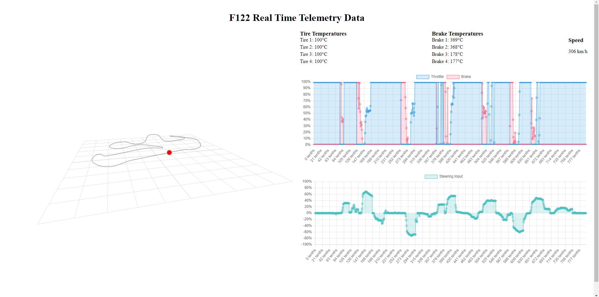

# Kafka-F1-Telemetry-Dashboard

This project aims to capture real-time telemetry data from the Formula 1 game (F1 22) and visualize it in real-time using a streaming architecture built on Apache Kafka, ksqlDB, and Schema Registry. The tool enables race engineers, developers, AI/ML engineers, data engineers, and analytics professionals to gain insights from the telemetry data and explore its potential applications in sim racing, driver training and race prep.



## Technology Stack

- **Apache Kafka**: A distributed streaming platform for handling real-time data streams. It serves as the core messaging system for our streaming architecture, providing scalability, fault-tolerance, and efficient data ingestion. This project uses Confluent Cloud.

- **ksqlDB**: A stream processing layer built on top of Kafka. It allows real-time data processing and transformations using a SQL-like query language. We leverage ksqlDB for stream processing and analytics on the captured telemetry data.

- **Schema Registry**: A centralized schema management system for ensuring data serialization and compatibility. It enforces consistent data formats and enables seamless integration between different components of the streaming architecture.

- **TypeScript**: A strongly-typed superset of JavaScript that adds static typing to the language. We use TypeScript for recieving and transforming the UDP packets sent from the game as well as to build the data producers and consumers components of the project.

- **HTML & CSS**: Web frontend tools to show the telemetry data being consumed in various formats like charts.


## Requirements

To run this project locally, you will need the following:

- F122 (for EA Sports)
- A Cloud or Self Managed Kafka Cluster
- Nodejs
- Typescript
- f1-22-udp (node package by @raweceek-temeletry)
- HTML5 CSS3


## Installation and Setup

Please follow the steps below to get the project up and running:

1. Clone this repository to your local machine.

2. npm install relavant dependancies

3. Setup and configure a Kafka Cluster and ksqlDB, follow a tutorial here: [https://www.youtube.com/watch?v=jItIQ-UvFI4&list=PLa7VYi0yPIH0oXBG_zpZHte86wISquelj&index=4]


## Usage

1. Start F122 and configure UDP settings under Telemetry settings

2. Create and configure Kafka Cluster details in src/KAFKA_CONFIG

3. Run the game in a race session, run producer file (f122.js) then the consumer (engineerDashboard.js) then oepn index.html in a browser

### typescript example with imports


```ts
import { F122UDP } from "f1-22-udp";
/*
*   'port' is optional, defaults to 20777
*   'address' is optional, defaults to localhost, in certain cases you may need to set address explicitly
*/

const f122: F122UDP = new F122UDP();
f122.start();
// motion 0
f122.on('motion',function(data) {
    console.log(data);
})
```

### CommonJS 

```js
const { F122UDP } = require("f1-22-udp")
/*
*   'port' is optional, defaults to 20777
*   'address' is optional, defaults to localhost, in certain cases you may need to set address explicitly
*/

const f122 = new F122UDP()
f122.start();
// motion 0
f122.on('motion', function (data) {
    console.log(data);
})

f122.on("event", data => {
    console.log(data);
}) 


```

## Contributing

Any contributions from the community to enhance this project are welcome. If you encounter any issues, have ideas for improvements, or would like to contribute new features, please submit a pull request.

## License

Apache 2.0

## Contact

Personal Email : lec.enoch@outlook.com
Business Email : enoch@synthesis.co.za

